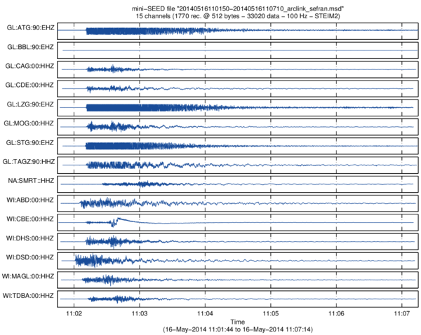

# mseed-matlab

The Standard for the Exchange of Earthquake Data (SEED) is an
international standard format for the exchange of digital seismological
data. SEED was designed for use by the earthquake research community,
primarily for the exchange between institutions of unprocessed earth
motion data. It is a format for digital data measured at one point in
space and at equal intervals of time. The SEED format consists of
Volume Control Headers, Abbreviation Control Headers, Station Control
Headers, Time Span Control Headers and finally Data Records. In
complement to “Dataless” SEED volumes, exists the “Data-only” volume
called Mini-SEED (see http://www.iris.edu for further information).

The purpose of these functions is to read and write miniSEED data files
directly from Matlab, avoiding intermediate format conversion (like SAC
or other formats for which many functions exist), having a full control
on headers and formats.

The function has the particularity to be respectful of the SEED standard,
thus should be able to read ANY miniSEED file: all known encoding formats,
multiplexed channels, data sampling, mixed encoding formats, mixed block 
sizes and even mixed endianness (it appends!).

## rdmseed.m: reading miniSEED file

Each data record is imported into a structure array, allowing to adress
data blocks and header fields individually (useful for multi-channel
files), just as concatenating all data with a simple cat(1,X.d)
function. Time stamps are also converted into Matlab datenum format.
The function reads miniSEED "data-only" using the two mostly used
compression formats Steim-1 and Steim-2. General FDSN formats have also
been implemented (ASCII, 16/24/32-bit integers, IEEE floats and
doubles), and GEOSCOPE multiplexed old formats (24-bit, 16/3 or
16/4-bit gain ranged). All these formats should work but some of them
have not been tested using real data. I also partly coded Steim-3
format but without a clear description and any file example... Since I
never met any data file using this format, I don't know if it's really
useful.

The function detects also automatically big/little-endian coded files.

Known Blockettes are 1000, 1001, 100, 500 and 2000. If there is no
Blockette 1000 (which is mandatory in SEED format...), default
4096-byte record length, big-endian and Steim-1 compression are used.
These values can be set using additional arguments.

Using extra output argument, some analysis can be done on the data
stream (detection of gaps and overlaps), and channel components are
detected. Without any output arguments, or with an additionnal 'plot'
input argument, the function plots the imported data in a new figure
(works also in case of multi-channel file).

Steim-1/2 compression decoding strategy has been deeply optimized for
Matlab. The proposed method, as vectorized as possible, is about 30
times faster than a 'C-like' loops coding... which is still 10 times
slower than the same C-compiled program, but, well, this is the
Matlab's other side of the coin!

## mkmseed.m: writing miniSEED file

The function allows to export a data vector D to miniSEED file, giving
origin date and time (for monotonic data) and sampling rate, or a time
vector. Header information is specified using the filename string with
conventional naming "Network.Station.Location.Channel". Output file
names will have appended ".Year.Day" and multiple file may be produced
if data exceed a day.

Data encoding format can be specified (16/32-bit integers, IEEE
float/double, Steim-1/2, Geoscope 16/3-4). If not, it will depend on
the class of variable D. Binary file is big-endian coded, and default
record length is 4096 bytes (this may be changed using input argument).

## Author
**François Beauducel**, IPGP, [beaudu](https://github.com/beaudu), beauducel@ipgp.fr 

## Documentation
Type "doc rdmseed" or "doc mkmseed" for detailed usage.
